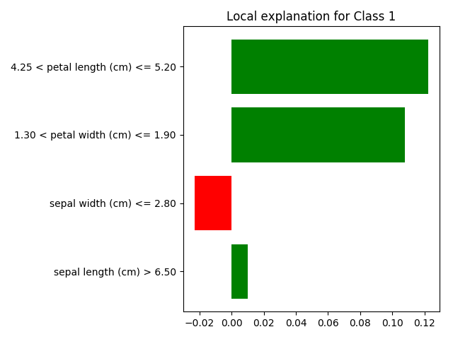

============================================
Local Interpretable Model Explanation (LIME)
============================================

Usage
-----

This approach in essence takes the instance passed to it, perturbs each feature such that it explores the local feature space
and learns a linear model around this area. It is important to note that the explanations it gives for values that a feature takes, can only be valid when all the other values stay somewhat similar.

Simply pass a 1D array to the following function, along with an optional filename to export the explanation and a class to associate the explanation with. By default, the plot_class variable
takes the value -1 and thus will use the predict function of the model to choose a class to explain the instance with.

.. code-block::

    xai.lime.tabular_explanation(test_x[16], plot_class=-1, filename="lime_explanation.png")
    
Below is the plot of the local model's effects, with this example indicating that the feature "sepal_width (cm)" has a negative 
effect on the prediction of Class 1, while the rest of the features have a positive effect. Interpreted in terms of the local model itself,
the weight associated with "sepal width (cm)" will be negative, while the others positive.

The ranges that are given with the features define the local area in feature space that the local model is working in.
    

    
    Figure 1: Plot of the instance's approximate local effects of each feature.

Requisites
----------

The model's predict function is required, as well as the training data. The training data is only required to calculate the mean and standard deviation by which to perturb the features 
to get the neighbourhood. On top of this is the instance to be explained.

Accepted Models/Data
--------------------

Models
^^^^^^

The underlying LIME package takes the model's predict function as a parameter, meaning that theoretically this technique can work with any model.

Data
^^^^

LIME currently supports tabular data, text and also images.

In regards to tabular data, the LIME subpackage recognises:

* Categorical data. This needs to be specified as a parameter to the function.
* Numerical data. This is the default type and is used unless specified otherwise.

Dimensionality
--------------

blah blah blah (is this section needed??)

Caveats
-------

What's Local?
^^^^^^^^^^^^^

As explained below †, due to the difficulty of defining the decision boundary, the effectiveness of the resultant explanation is mostly unknown. Baked into this problem is the issue of how large to make the neighbourhood, as the orientation of the
local linear model depends on it highly.

In addition to this, the current version of LIME samples the neighbourhood using a Gaussian distribution, meaning that the real distribution defined by the correlation between the features is ignored - thus
creating a neighbourhood with instances outside of the actual "catchment area".

Inconsistency
^^^^^^^^^^^^^

It was shown by the authors of the paper that very similar instances resulted in drastically different local explanations. This lack of consistency definitionally cannot provide explanations to be relied on without
substantiation from other explainability methods.

Output interpretation
---------------------

The explanation returned and plotted by the LIME algorithm is essentially the hyperparameters for a linear model. In linear models, the size of the weight indicates the size of the contribution towards the prediction
and the sign of the weight tells you whether it increases or decreases the value of the prediction.

In the example below (adapted from the LIME paper itself) you can see two different classes, which are represented by the different colours. The big red plus is the instance to be explored, with the remaining pluses being other instances 
of the same class, and the blue dots belonging to the other class. The algorithm then uses this root instance's neighbours to define the local area, with more proximal instances (the larger ones) having a larger influence.
Using this information the algorithm outputs the dotted line as an explanation of the model in that specific region of the feature space - defining left of the line as 'red' and right as 'blue. This is clearly globally inaccurate as we can see 'blue'
instances way to the left of the line. 

† To illustrate the limitations of this approach, I have added an instance to the diagram below in the shape of a red asterix. Should this have been selected as the instance to be explained, and even granting that the neighbourhood of said
instance was densely populated, it is safe to say the likely explanation LIME would output, would categorically be a less useful explanation compared to the bold red cross. This is because in the original example, the actual decision boundary is aligned with the local model 
for an extent, meaning the linear explanation is correct for a larger segment of the feature space. The reason this is problematic is because the actual decision boundary is next to impossible to define, meaning it's very difficult to differentiate
between a widely applicable explanation, and a narrow and effectively useless one.

.. figure:: ../../assets/lime_vis.png
    :align: center
    :scale: 50
    
    Visualisation of the LIME algorithm in a simplified feature space.